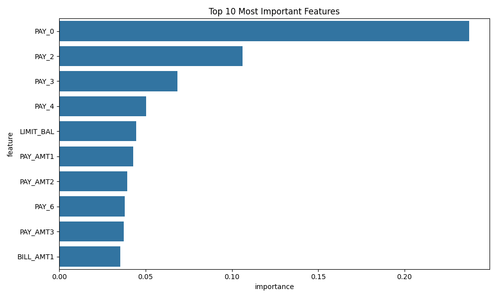
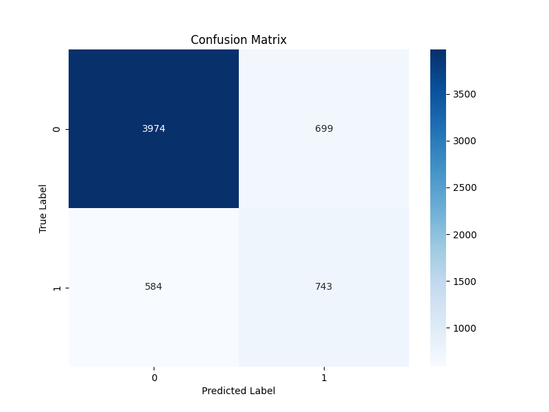

# 🎯 Credit Risk Prediction Project

## 📋 Project Overview
This project implements a machine learning model to predict credit risk using historical payment data. The model uses a Random Forest Classifier to predict the likelihood of default payments based on various customer features.

## 📊 Key Results

### Feature Importance

<div align="center">
  
</div>

The top features influencing credit risk prediction are:
* Previous payment status (PAY_0, PAY_2, PAY_3)
* Credit limit balance (LIMIT_BAL)
* Payment amounts (PAY_AMT1, PAY_AMT2)

### Model Performance

<div align="center">
  
</div>

The confusion matrix shows:
* True Negatives (Correct non-default predictions): 3974
* False Positives: 699
* False Negatives: 584
* True Positives (Correct default predictions): 743

## 🛠️ Technical Requirements
* Python 3.x
* pandas
* numpy
* scikit-learn
* PyYAML
* joblib

## 📂 Project Structure
```
credit-risk-prediction/
├── data/
│   ├── raw/
│   │   └── credit_data.csv
│   └── processed/
│       ├── X_train.csv
│       ├── X_test.csv
│       ├── y_train.csv
│       ├── y_test.csv
│       └── feature_names.yaml
├── models/
│   ├── metrics/
│   │   └── test_metrics.json
│   ├── model_[timestamp].joblib
│   └── metrics_[timestamp].json
├── prepare.py
├── train.py
└── evaluate.py
```

## 🔍 Features
* Data preprocessing and cleaning
* Feature engineering with one-hot encoding
* Standardization of numerical features
* Random Forest model with balanced class weights
* Model evaluation and performance metrics
* Automated saving of models and metrics

## 🚀 Usage

### 1. Data Preparation
```bash
python prepare.py
```
This script:
* Loads raw credit data
* Removes unnecessary columns
* Handles missing values
* Performs one-hot encoding
* Scales features
* Splits data into training and test sets

### 2. Model Training
```bash
python train.py
```
This script:
* Loads processed training data
* Trains a Random Forest model
* Saves the trained model and training metrics
* Generates feature importance analysis

### 3. Model Evaluation
```bash
python evaluate.py
```
This script:
* Loads test data and trained model
* Generates predictions
* Calculates performance metrics
* Creates confusion matrix
* Saves evaluation results

## 📈 Model Performance
The Random Forest model achieves balanced performance with:
* High accuracy in identifying non-default cases
* Reasonable detection of default cases
* Built-in handling of class imbalance

## ⚠️ Known Limitations
* Model performance depends on the quality of input data
* Class imbalance may affect prediction bias
* Feature importance may vary across different datasets

## 📝 License
This project is licensed under the MIT License.
